# ⚔️ Total War: WARHAMMER III Trainer – Ultimate Campaign & Battle Control

Forge your destiny across the Chaos Realms with the **Total War: WARHAMMER III Trainer** — a comprehensive enhancement suite for total campaign domination and battle control.

This external trainer was engineered for **Windows 10/11** and fully supports both **single-player campaigns** and **custom battles**, giving you the tools to command vast armies with limitless power, resources, and momentum.

Perfect for players who want to focus on **strategy, lore, and empire-building** instead of grind — this tool delivers complete balance control without affecting the visual or story experience.

---

## ⚙️ Overview

The **WARHAMMER III Trainer** gives you full control of your empire’s resources, armies, and settlements.
From **infinite treasury** to **instant building completion**, this toolkit simplifies logistics so you can focus on tactics, expansion, and narrative events.

[!NOTE]

> This trainer is optimized for **single-player campaign** play. Use responsibly for balance-friendly gameplay testing or sandbox enjoyment.

### Core Advantages

* Infinite gold and treasury management 💰
* God mode for units and lords
* Instant recruitment and construction
* Unlimited Winds of Magic during battles
* Movement and cooldown reset each turn
* Diplomacy & population growth control

---

## 🧩 Key Features

| Feature                  | Description                                      |
| ------------------------ | ------------------------------------------------ |
| **Infinite Gold**        | Add or lock treasury values instantly.           |
| **Army God Mode**        | Units take no damage during battles.             |
| **Unlimited Movement**   | Armies and heroes can move freely each turn.     |
| **Instant Construction** | Buildings complete immediately in all provinces. |
| **Winds of Magic Boost** | Full recharge available in every spell phase.    |
| **Skill & XP Editor**    | Instantly level up lords, heroes, and armies.    |
| **Faction Control**      | Adjust corruption, growth, and public order.     |

---

## 💻 Compatibility

| Platform                     | Supported |
| ---------------------------- | --------- |
| **Windows 10 / 11 (64-bit)** | ✅         |
| **Steam / Epic / Game Pass** | ✅         |
| **Campaign / Custom Battle** | ✅         |
| **Modded Factions**          | ✅         |

[!IMPORTANT]

> The trainer is **single-player only**. Avoid using it in multiplayer or online modes to prevent desync or instability.

---

## ⚡ Setup & Usage

1. **Download** the verified WARHAMMER III Trainer package.

2. **Extract** all files into a separate folder.

3. Run `WH3Trainer.exe` as Administrator.

4. Launch *Total War: WARHAMMER III* and wait for “Linked” confirmation.

5. Use the default hotkeys:

   ```bash
   F1 – Add 100,000 Gold  
   F2 – Enable Army God Mode  
   F3 – Infinite Movement  
   F4 – Instant Construction  
   F5 – Max Winds of Magic  
   F6 – Unlock All Skills  
   F7 – Complete Current Research  
   F8 – Freeze Public Order  
   F9 – Add 10,000 Growth  
   ```

6. Press **INS** to open the visual overlay for value editing or to create hotkey macros.

[!WARNING]

> Some campaign scripts (like Chaos Rift timers) may not react instantly — advance one turn for full synchronization.

---

### 🧠 System Flow Diagram

```mermaid
flowchart TD
A[Launch Trainer] --> B[Detect WARHAMMER III Process]
B --> C{Selected Feature?}
C -- Economy --> D[Modify Treasury + Resources]
C -- Army --> E[Enable God Mode + Movement Reset]
C -- Magic --> F[Boost Winds of Magic Pool]
C -- Construction --> G[Set Build Time = 0]
D --> H[Live Campaign Update ✅]
E --> H
F --> H
G --> H
H --> I[Enhanced Strategic Control ⚔️]
```



---

## ⚙️ Configurable Options

You can edit all trainer parameters in `wh3_config.json`:

```json
{
  "gold_increment": 100000,
  "movement_reset": true,
  "god_mode": true,
  "instant_build": true,
  "magic_unlimited": true,
  "growth_rate": 10,
  "research_speed": "instant"
}
```

### Preset Profiles

* **Empire Builder:** Fast construction + infinite gold for sandbox play.
* **Battle Master:** Army god mode + unlimited magic for combat testing.
* **Balanced Commander:** Moderate boosts with natural cooldowns retained.

---

## ❓ FAQ

**Q: Does it support the Shadows of Change DLC?**
Yes. It auto-updates for all current expansions and factions.

**Q: Can I edit hero skill trees?**
Yes — the Skill Editor allows instant unlocks or manual allocation.

**Q: Does this affect achievements?**
If active, achievements are disabled for that session (to ensure fairness).

**Q: Will it cause save corruption?**
No. All effects are runtime only; saves revert to normal when the trainer is closed.

**Q: Does the overlay work in fullscreen?**
Yes — it supports DirectX 11 and 12 modes seamlessly.

---

## 🏁 Final Thoughts

The **Total War: WARHAMMER III Trainer** gives you the empire you’ve always imagined — vast, unstoppable, and entirely under your command.
Unleash divine power over magic, movement, and construction, and focus on what truly matters: **strategy, conquest, and glory.**

Rule the realms of Chaos and Order your way.

---

*© 2025 Total War: WARHAMMER III Trainer. Crafted for domination, balance, and strategic freedom.*
